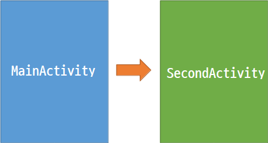
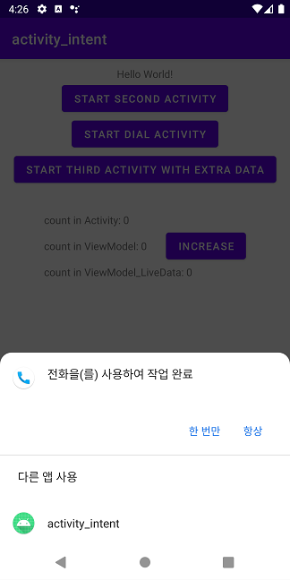
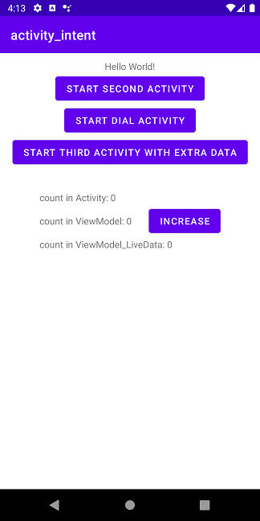
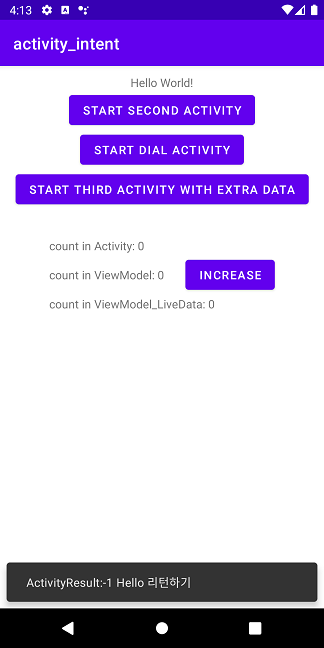
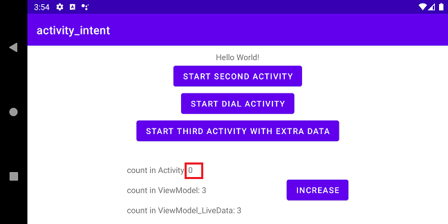

# Activity & Intent
<!-- _class: lead -->
### Activity, Intent, ViewModel, LiveData
### https://github.com/jyheo/android-kotlin-lecture


## 학습목표
- 액티비티(Activity)의 개념과 액티비티 라이프사이클을 이해하고 설명할 수 있다.
- 인텐트(Intent)의 용도와 명시적/암시적 인텐트의 차이를 설명하고 사용할 수 있다.
- 인텐트로 액티비티 간에 데이터를 주고 받도록 만들 수 있다.
- MVVM 패턴을 이해하고 ViweModel, LiveData를 이용하여 프로그래밍할 수 있다.
- 예제 소스 코드: https://github.com/jyheo/android-kotlin-lecture/tree/master/examples/activity_intent


## 액티비티(Activity)
- **Activity** 는 **앱 구성 요소**로서, **사용자와 상호작용할 수 있는 화면** 을 제공
- 안드로이드 앱 구성 요소: 액티비티, 서비스, 브로드캐스트 리시버, 컨텐트 프로바이더
- 앱의 시작은 액티비티에서 시작함
- 앱에는 여러 액티비티를 가질 수 있음
- 액티비티는 Activity 또는 AppCompatActivity를 상속하여 만듬
    - AppCompatActivity는 Jetpack 라이브러리에 포함된 것으로 오래된 안드로이드 버전에서도 사용 가능
    - AppCompatActivity 사용을 권장


## 액티비티(Activity) 사용
- setContentView()를 이용하여 액티비티의 View를 draw
    ```kotlin
    class MainActivity : AppCompatActivity() {
        private lateinit var binding: ActivityMainBinding

        override fun onCreate(savedInstanceState: Bundle?) {
            super.onCreate(savedInstanceState)
            binding = ActivityMainBinding.inflate(layoutInflater)
            setContentView(binding.root)
        }
    ```
- Android Manifest 파일에 Activity를 등록
    ```xml
    <manifest>
        <application>
            <activity android:name=".MainActivity" android:exported="true">
            </activity>
        </application>
    </manifest>
    ```

https://github.com/jyheo/android-kotlin-lecture/blob/master/examples/activity_intent/app/src/main/java/com/example/activity_intent/MainActivity.kt

https://github.com/jyheo/android-kotlin-lecture/blob/master/examples/activity_intent/app/src/main/AndroidManifest.xml

원래는 MainActivity가 Activity 클래스를 상속해서 만들어지지만, 이전 버전과 호환이 되면서 새로운 기능을 제공하는 Jetpack의 AppCompatActivity를 사용하는 것을 권장한다.

android:exported는 다른 앱에서 이 액티비티를 사용할 수 있도록 하는지 여부를 표시함. 런처 액티비티의 경우 외부에서 실행시켜야 하므로 exported를 반드시 true하고, 다른 액티비티들은 외부에서 사용할 일이 없는 경우 안전을 위해 false로 할 것.

참고: 안드로이드 Jetpack 라이브러리 https://developer.android.com/jetpack?hl=ko


## 액티비티(Activity) 사용 - 메소드 오버라이드
- 라이프 사이클 콜백 처리
  - onCreate, onStart, onResume, onPause, onStop, onDestroy()
- 설정 변경(세로/가로 보기 전환 등)에 따른 콜백 처리
  - onConfigurationChanged()
- 백(Back) 버튼 처리
  - onBackPressed()


## 액티비티 라이프 사이클
- onCreate()
- onStart()
- onResume()
- 액티비티 활성화
- onPause()
- onStop()
- onDestroy()


출처: https://developer.android.com/guide/components/activities.html


## 액티비티 전환 시 라이프 사이클 콜백
* MainActivity에서 SecondActivity 시작
  - MainActivity의 onPause()
  - SecondActivity의 onCreate(),
  - onStart(), onResume()
  - MainActivity의 onStop()
* 단말기의 뒤로가기 버튼 누름
  - SecondActivity의 onPause()
  - MainActivity의 onRestart(), onStart(), onResume()
  - SecondActivity의 onStop(), onDestroy()



https://github.com/jyheo/android-kotlin-lecture/blob/master/examples/activity_intent/app/src/main/java/com/example/activity_intent/MainActivity.kt

https://github.com/jyheo/android-kotlin-lecture/blob/master/examples/activity_intent/app/src/main/java/com/example/activity_intent/SecondActivity.kt


## 인텐트
- **Intent**는 일종의 **메시지 객체**
- 다른 **앱 구성 요소**에 Intent를 보내 작업을 요청
- 기본적인 사용 사례
    - 액티비티 시작하기
    - 서비스 시작하기
    - 브로드캐스트 전달하기

출처: https://developer.android.com/guide/components/intents-filters.html

서비스는 화면이 없는 실행 요소입니다. 보통 백그라운드로 실행될 것들을 서비스로 만들고 포그라운드로 UI를 갖는 것은 액티비티로 만듭니다.

브로드캐스트는 시스템에서 방송하는 기능으로 브로드캐스트 리시버가 이를 받을 수 있습니다. 예를 들어 문자가 왔다는 것을 브로드캐스트 하거나 배터리 잔량을 브로드캐스트 합니다.


## 인텐트로 액티비티 시작하기
- startActivity() 메소드를 사용하여 다른 액티비티를 시작할 수 있음
    ```kotlin
    val intent = Intent(this, SecondActivity::class.java)
    startActivity(intent)
    ```
    - 시작하려는 액티비티(SecondActivity.class)를 지정하고 Intent 생성
        - 이렇게 명시적으로 액티비티 클래스를 지정하는 것을 **명시적 인텐트** 라고 함
    - startActivity()에 인텐트 객체를 인자로 해서 호출
- startActivity() 메소드는 액티비티나 서비스에서 사용 가능
- 시작한 액티비티로부터 결과를 받으려면 다른 방법 사용
    - registerForActivityResult() 사용
    - 참고: startActivityForResult() 는 deprecated 되어서 사용 중단


## 인텐트 유형
- 명시적(explicit) 인텐트 – 시작할 구성 요소의 이름을 지정
- 암시적(implicit) 인텐트 – 이름을 지정하지 않고 일반적인 작업(전화걸기, 지도보기 등)을 지정
     


## 암시적(Implicit) 인텐트 사용
- 필요한 Action을 지정하고 Intent를 생성
    ```kotlin
    val implicitIntent = Intent(Intent.ACTION_DIAL, Uri.parse("tel:114"))
    startActivity(implicitIntent)
    ```
- 해당 액션과 데이터를 처리할 수 있는 태스크가 시작됨
    - 만일 여러개가 있을 경우 선택 창이 나타남
    - 이 예에서는 전화걸기 앱이 시작되고 114라는 번호가 미리 입력되어 있음


https://github.com/jyheo/android-kotlin-lecture/blob/master/examples/activity_intent/app/src/main/java/com/example/activity_intent/MainActivity.kt#L29-L32


## 암시적 인텐트 받기(인텐트 필터)
- 암시적 인텐트를 받기 위해서는 받으려는 액션과 데이터 스키마를 지정해주면 됨
- AndroidManifest.xml에 인텐트 필터를 추가
    ```xml
    <activity android:name=".SecondActivity" android:exported="true">
        <intent-filter>
            <action android:name="android.intent.action.DIAL" />
            <category android:name="android.intent.category.DEFAULT" />
            <data android:scheme="tel" />
        </intent-filter>
    </activity>
    ```
    - ACTION_DIAL 로 startActvity()를 하면 기존 전화 앱과 SecondActivity를 선택하는 창이 나타남
- 참고: MAIN, 앱을 실행할 때 처음 시작하는 액티비티
    ```xml
    <activity android:name=".MainActivity" android:exported="true">
        <intent-filter>
            <action android:name="android.intent.action.MAIN" />
            <category android:name="android.intent.category.LAUNCHER" />
        </intent-filter>
    </activity>
    ```



https://github.com/jyheo/android-kotlin-lecture/blob/master/examples/activity_intent/app/src/main/AndroidManifest.xml


## (명시적) 인텐트에 데이터 넣어서 보내고 받기
- MainActivity의 onCreate() 에서 액티비티 결과를 받을 콜백 등록
    ```kotlin
        val activityResult = registerForActivityResult(ActivityResultContracts.StartActivityForResult()) {
            val msg = it.data?.getStringExtra("ResultString") ?: ""
            Snackbar.make(binding.root, "ActivityResult:${it.resultCode} $msg", Snackbar.LENGTH_SHORT).show()
            Log.i(TAG, "ActivityResult:${it.resultCode} $msg")
        }
    ```
- MainActivity에서 ThirdActivity로 인텐트를 보내고 결과 인텐트를 기다려서 받기
    ```kotlin
        // 인텐트를 ThirdActivity로 보내기
        val intent = Intent(this, ThirdActivity::class.java)
    →   intent.putExtra("UserDefinedExtra", "Hello")
    →   activityResult.launch(intent)
    ```


MainActivity에서 registerForActivityResult()로 콜백 등록하고, launch()를 하면 ThirdActivity가 시작된다.
ThirdActivity는 받은 intent에서 데이터를 가져온다.

---
- ThirdActivity 에서 MainActivity가 보낸 인텐트 받기
    ```kotlin
    class ThirdActivity : AppCompatActivity() {
        override fun onCreate(savedInstanceState: Bundle?) {
            super.onCreate(savedInstanceState)
            setContentView(R.layout.activity_third)
    →       val msg: String = intent?.getStringExtra("UserDefinedExtra") ?: ""
            val et = findViewById<EditText>(R.id.editText)
            et.setText(msg)
        }
    ```
- ThirdActivity 에서 결과 인텐트 되돌려 주기
    ```kotlin
    override fun onBackPressed() {
        val et = findViewById<EditText>(R.id.editText)
        val resultIntent = Intent()
    →   resultIntent.putExtra("ResultString", et.text.toString())
    →   setResult(RESULT_OK, resultIntent)
        super.onBackPressed()
    }
    ```


https://github.com/jyheo/android-kotlin-lecture/blob/master/examples/activity_intent/app/src/main/java/com/example/activity_intent/MainActivity.kt

https://github.com/jyheo/android-kotlin-lecture/blob/master/examples/activity_intent/app/src/main/java/com/example/activity_intent/ThirdActivity.kt

ThirdActivity가 리턴할 인텐트(resultIntent)를 만들고 setResult() 메소드로 전달한다. MainActivity에서 등록한 콜백을 통해 resultIntent를 받게 된다.


---
- 실행 결과
   

실행 후 START THIRD ACTIVITY를 클릭하면
ThirdActivity가 시작되고, MainActivity에서 전달받은 Hello 문자열을 출력한다.
EditText의 내용을 "Hello 리턴하기"라고 수정하고 백(Back) 버튼을 누르면 ThirdActivity는 사라지고 MainActivity가 나타난다. 이 때 ThirdActivity로부터 받은 result 값과 intent에 포함된 문자열을 스낵바로 보여준다.


## MVVM(Model - view - viewmodel)
- 뷰와 모델을 분리하는 대표적인 소프트웨어 아키텍처 패턴
    - 여기에서 뷰는 GUI를 의미하고 모델은 GUI에 표시되거나 GUI에 의해 변경되는 내부에서 관리하는 데이터를 의미함
- 안드로이드 Jetpack의  ViewModel 클래스를 사용하면 MVVM을 쉽게 구현할 수 있음
    - 액티비티가 뷰이고 모델은 파일이나 DB 등이 될 수 있음
- 안드로이드에서 액티비티가 직접 모델을 관리하게 되면 액티비티의 설정 변경으로 인한 액티비티 재생성으로 인해 관리하던 모델도 초기화가 되버리는 문제가 있음
    - 예) 언어 설정을 변경하거나 화면을 회전시키면 액티비티가 새로 생성됨
    - 즉, onDestroy(), onCreate()가 호출되면서 새로 액티비티가 만들어짐
    - 액티비티 내에 관리하던 모델들도 모두 새로 생성 됨


https://github.com/jyheo/android-kotlin-lecture/blob/master/examples/activity_intent/app/src/main/java/com/example/activity_intent/MyViewModel.kt

https://github.com/jyheo/android-kotlin-lecture/blob/master/examples/activity_intent/app/src/main/java/com/example/activity_intent/MainActivity.kt#L40-L53


---
- 액티비티에서 모델을 관리하는 경우
    ```kotlin
    class MainActivity : AppCompatActivity() {
        private lateinit var binding: ActivityMainBinding
        private var count = 0  // 액티비티에서 관리하는 모델

        override fun onCreate(savedInstanceState: Bundle?) {
            super.onCreate(savedInstanceState)
            binding = ActivityMainBinding.inflate(layoutInflater)
            setContentView(binding.root)

            // 모델을 뷰에 표시
            binding.textViewCount.text = getString(R.string.count_in_activity, count)

            binding.buttonIncr.setOnClickListener {
                // 버튼이 눌릴 때마다 모델을 변경하고 뷰를 업데이트
                count++
                binding.textViewCount.text = getString(R.string.count_in_activity, count)
            }
        }
    ```
    - 버튼을 누를 때마다 값이 증가하지만, **언어 설정을 바꾸거나 화면을 회전시키면 값이 0으로 초기화되는 문제**가 있음

액티비티의 onSaveInstanceState()를 오버라이드하여 설정 변경에 대응하여 저장된 데이터를 액티비티가 재생성될 때 Bundle 객체로 전달 하여 이 문제를 해결할 수도 있다. 하지만, 데이터의 크기를 최소로해야 하며, 다음에 나오는 ViewModel을 활용하는 것에 비해 코드가 아름답지 못하다(주관적인 견해임).

---
- ViewModel을 사용하여 문제 해결 - ViewModel 클래스
    ```kotlin
    class MyViewModel : ViewModel() {
        var count = 0

        fun increaseCount() {
            count++
        }
    }
    ```
    - ViewModel 객체는 직접 생성하지 않고 반드시 ViewModelProvider를 이용해야 함
    - ViewModel에 생성자 인자를 추가하려면 ViewModelFactory도 만들어서 사용해야 함

---
- ViewModel을 사용하여 문제 해결 - 액티비티 클래스
    ```kotlin
    class MainActivity : AppCompatActivity() {
        private lateinit var viewModel: MyViewModel  // 뷰 모델
        private lateinit var binding: ActivityMainBinding

        override fun onCreate(savedInstanceState: Bundle?) {
            super.onCreate(savedInstanceState)
            binding = ActivityMainBinding.inflate(layoutInflater)
            setContentView(binding.root)

            // ViewModel
            viewModel = ViewModelProvider(this)[MyViewModel::class.java] // 뷰 모델 획득
            binding.textViewCountViewmodel.text = getString(R.string.count_in_ViewModel, viewModel.count)

            binding.buttonIncr.setOnClickListener {
                viewModel.increaseCount() // 뷰 모델에게 데이터 변경 요청
                binding.textViewCountViewmodel.text = getString(R.string.count_in_ViewModel, viewModel.count)
            }
        }
    ```
    - 뷰 모델을 가져오기 위해 ViewModelProvider(라이프사이클 소유자).get(뷰 모델 클래스)을 호출
        - 라이프사이클 소유자(여기서는 액티비티)가 실제로 사라질 때까지 뷰 모델을 유지함
        - 해당 뷰 모델 클래스에 대한 객체가 하나만 만들어짐(Singleton과 유사)

뷰 모델은 라이프사이클 소유자, 여기에서는 액티비티가 실제로 사라질 때까지 유지된다. 즉, 언어 설정 변경이나 화면 회전으로 인한 액티비티 재생성의 경우에도 뷰 모델은 메모리에서 사라지지 않고 그대로 유지된다.

ViewModelProvider의 get() 메소드는 라이프사이클 소유자(액티비티)가 생성된 후, 처음 호출될 때만 뷰 모델 객체를 생성하여 리턴하고, 그 이후 호출 부터는 이미 만들어진 뷰 모델 객체의 레퍼런스를 리턴한다. 마치 싱글톤 패턴처럼 동작한다.

라이프사이클 소유자는 여기에서는 액티비티가 되지만, 이후에 배우는 프래그먼트도 라이프사이클 소유자가 될 수 있다.


## MVVM에 LiveData 추가
- LiveData는 데이터가 변경될 때마다 호출되는 콜백 함수를 등록하여 사용할 수 있음
    - 액티비티와 같이 라이프사이클 소유자와 연결하여 해당 소유자가 활동중일 때만 콜백을 받음
- 앞의 MyViewModel을 다음과 같이 변경
    ```kotlin
    class MyViewModel : ViewModel() {
        val countLivedata: MutableLiveData<Int> = MutableLiveData<Int>()

        init {
            countLivedata.value = 0
        }

        fun increaseCount() {
            countLivedata.value = (countLivedata.value ?: 0) + 1
        }
    }
    ```

ViewModel과 꼭 같이 써야 하는 것은 아니다.


---
- MyViewModel의 countLivedata에 observe() 메소드를 호출하여 콜백 함수 등록
    ```kotlin
    class MainActivity : AppCompatActivity() {
        private lateinit var binding: ActivityMainBinding

        override fun onCreate(savedInstanceState: Bundle?) {
            super.onCreate(savedInstanceState)
            binding = ActivityMainBinding.inflate(layoutInflater)
            setContentView(binding.root)

            // ViewModel
            val viewModel = ViewModelProvider(this)[MyViewModel::class.java]
            viewModel.countLivedata.observe(this) {
                binding.textViewLivedata.text = getString(R.string.count_in_ViewModel_LiveData, it)
            }

            binding.buttonIncr.setOnClickListener {
                viewModel.increaseCount()
            }
        }
    ```
    - 버튼이 클릭될 때는 뷰 모델의 데이터를 변경만 하면
    - countLivedata에 등록된 콜백이 불리고 콜백에서 뷰를 업데이트 함


---
- 뷰에서 데이터 관리, MVVM 패턴, LiveData 추가 실행 결과
 

https://github.com/jyheo/android-kotlin-lecture/blob/master/examples/activity_intent/app/src/main/java/com/example/activity_intent/MyViewModel.kt

https://github.com/jyheo/android-kotlin-lecture/blob/master/examples/activity_intent/app/src/main/java/com/example/activity_intent/MainActivity.kt#L40-L53


## 초기값을 받는 ViewModel 만들기
- 아래와 같이 생성자 인자를 받아서 초기값을 주고 싶은 경우
    ```kotlin
    class MyViewModel(count: Int) : ViewModel() {
        val countLivedata: MutableLiveData<Int> = MutableLiveData<Int>()
        init {
            countLivedata.value = count
        }
        fun increaseCount() {
            countLivedata.value = (countLivedata.value ?: 0) + 1
        }
    }
    ```
- ViewModelProvider로 ViewModel을 생성, 생성자 인자를 줄 방법이 없음
    - ```val viewModel = ViewModelProvider(this)[MyViewModel::class.java]```


## 초기값을 받는 ViewModel을 위해 ViewModelProvider.Factory
- ViewModelProvider.Factory로 생성자 인자를 받을 수 있는 커스텀 ViewModelProvider를 생성
    ```kotlin
    class MyViewModelFactory(private val count: Int) : ViewModelProvider.Factory {
        override fun <T : ViewModel> create(modelClass: Class<T>): T {
            if (modelClass.isAssignableFrom(MyViewModel::class.java)) {
                return MyViewModel(count) as T  // the warning 'unchecked cast' is unavoidable.
            }
            throw IllegalArgumentException("Unknown ViewModel class")
        }
    }
    ```
- 사용은 다음과 같이, 생성자 인자로 10이 MyViewModel에 주어짐
    ```
    viewModel = ViewModelProvider(this, MyViewModelFactory(10)).get(MyViewModel::class.java)
    ```

# Q&A
<!-- _class: lead -->