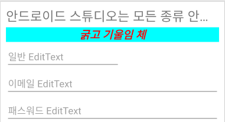
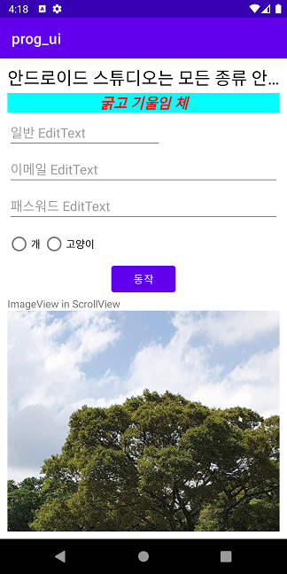
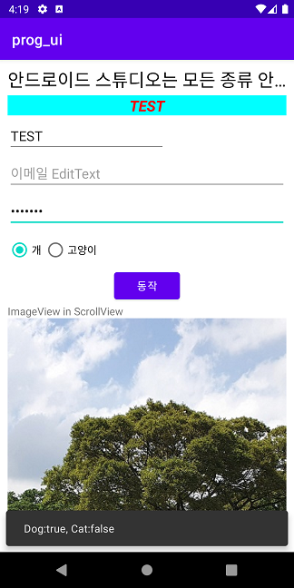

# UI 프로그래밍
<!-- _class: lead -->
### https://github.com/jyheo/android-kotlin-lecture


## 학습목표
- 레이아웃 XML에서 TextView와 EditText의 외형과 관련된 속성을 이해하고 사용할 수 있다.
- 리소스 문자열을 사용하여 다국어 레이아웃을 만들 수 있다.
- 스타일과 테마를 이해하고 사용할 수 있다.
- ImageView 위젯을 사용하여 이미지를 표시할 수 있다.
- ScrollView를 사용하여 크기가 큰 위젯이 스크롤되도록 만들 수 있다.
- ViewBinding을 이용하여 위젯 객체를 접근할 수 있다.
- 사용자 버튼 클릭에 따라 위젯의 내용을 동적으로 변경할 수 있다.

https://github.com/jyheo/android-kotlin-lecture/tree/master/examples/prog_ui


## TextView와 EditText
- TextView는 텍스트를 출력하기 위한 위젯
- EditText는 텍스트를 입력받기 위한 위젯
- EditText는 TextView를 상속하기 때문에 TextView의 속성을 그대로 사용
- 텍스트 외형을 속성을 사용해 변경할 수 있음
    - android:text 실제 표시될 텍스트
    - android:textSize 텍스트 크기, 단위는 sp
    - android:textStyle 굵은글씨(bold), 기울임글씨(italic)
    - android:textColor 텍스트 색
    - android:textAlignment 좌, 우, 중앙 정렬
    - android:singleLine 강제로 한 줄 표시
    - android:ellipsize 텍스트 출력할 공간이 부족할 경우 ... 표시 (singleLine과 함께 사용)

---
- EditText에서 주로 사용하는 속성
    - android:ems 입력 받을 글자 수, 즉 EditText의 가로 크기
    - android:hint 입력 내용이 없을 때 표시되는 힌트
    - android:inputType 입력 받을 텍스트 종류(숫자, 패스워드, 이메일, 전화번호 등)
        - 패스워드일 경우 입력한 글자 대신 * 가 표시됨

EditText에서 주로 사용하는 속성들도 모두 TextView에서 정의된 속성이다.

---
- 레이아웃에서 TextView, EditText 속성 예
    ```xml
    <TextView
        android:layout_width="match_parent"     android:layout_height="wrap_content"
        android:layout_marginBottom="5dp"
    →   android:ellipsize="end"
    →   android:singleLine="true"
    →   android:textSize="24sp"
        android:text="@string/long_text"/>

    <TextView
        android:layout_width="match_parent"     android:layout_height="wrap_content"
        android:layout_marginBottom="5dp"
    →   android:textColor="#ff0000"
        android:background="#00ffff"
    →   android:textAlignment="center"
    →   android:textStyle="bold|italic"
    →   android:textSize="20sp"
        android:text="@string/bold_italic" />

    <EditText
        android:layout_width="wrap_content"     android:layout_height="wrap_content"
        android:layout_marginBottom="5dp"
    →   android:ems="10"
    →   android:inputType="textPersonName"
        android:importantForAutofill="no"
    →   android:hint="@string/normal_edit_text" />

    <EditText
        android:layout_width="match_parent"     android:layout_height="wrap_content"
        android:layout_marginBottom="5dp"
    →   android:inputType="textEmailAddress"
        android:importantForAutofill="no"
    →   android:hint="@string/email_edit_text"/>

    <EditText
        android:layout_width="match_parent"     android:layout_height="wrap_content"
        android:layout_marginBottom="5dp"
    →   android:inputType="textPassword"
        android:importantForAutofill="no"
    →   android:hint="@string/password_edit_text"/>
    ```


https://github.com/jyheo/android-kotlin-lecture/blob/master/examples/prog_ui/app/src/main/res/layout/activity_main.xml#L7-L55


## 리소스 - 문자열
- 앞의 예에서 android:text와 android:hint 속성의 값을 문자열이 아닌 @string/xxxx 를 사용
    - 문자열을 직접 쓸 수도 있지만, 리소스에 정의해 둔 문자열의 ID를 쓰는 것을 권장함
- 이렇게 문자열을 리소스로 관리하고 문자열이 필요한 곳에서 ID를 참조하도록 하면
    - 시스템 언어 설정에 따라 해당 언어가 자동으로 표시되어 다국어 버전 앱 만들 때 유용함
- 문자열 리소스 XML
    - src\main\res\values\strings.xml
    ```xml
    <resources>
        <string name="app_name">prog_ui</string>
        <string name="bold_italic">bold and italic</string>
    </resources>
    ```
    - 다른 리소스 XML에서 @string/app_name 으로 참조할 수 있음

---
- 다국어 지원을 위해 언어마다 문자열 리소스를 정의
    - 기본 언어 문자열 정의는 src\main\res\values\strings.xml
    - 특정 언어(한국어)의 문자열 정의는 src\main\res\values-ko-rKR\strings.xml
    - 안드로이드 스튜디오의 문자열 에디터를 사용하면 손쉽게 여러 언어 문자열 관리할 수 있음
        - strings.xml을 오픈하고 오른쪽 위의 [Open editor] 링크를 클릭하면 Translations Editor가 나타남
        
        - 빨간 표시된 버튼을 눌러서 언어 추가

---
- 시스템 언어 설정에 따라 문자열에 다르게 표시됨
 


## 스타일과 테마(Style & Theme)
- **스타일**은 위젯의 외형과 관련된 속성(색깔, 크기 등)을 하나의 세트로 만들어 둔 것
- 미리 만들어 둔 스타일을 위젯의 스타일로 지정하면 해당 속성이 모두 적용됨
- 스타일 파일 src\main\res\values\styles.xml 에서 mytextview 라는 스타일을 정의
    ```xml
    <resources>
        <style name="mytextview">
            <item name="android:textSize">24sp</item>
            <item name="android:textColor">#000000</item>
        </style>
    </resources>
    ```
- 위젯 정의 할 때 style 속성으로 지정
    ```xml
    <TextView
        android:layout_width="match_parent"        android:layout_height="wrap_content"
    →   style="@style/mytextview"
        android:text="@string/long_text"/>
    ```

https://github.com/jyheo/android-kotlin-lecture/blob/master/examples/prog_ui/app/src/main/res/values/styles.xml

https://github.com/jyheo/android-kotlin-lecture/blob/master/examples/prog_ui/app/src/main/res/layout/activity_main.xml#L14


---
- **테마**는 앱 전체에 적용되는 스타일
- 스타일과 같은 형식으로 정의, 위젯의 속성 뿐 아니라 테마 색을 지정할 수 있음
- 보통 테마를 위한 스타일 파일은 src\main\res\values\themes.xml
    ```xml
    <resources xmlns:tools="http://schemas.android.com/tools">
        <!-- Base application theme. -->
    →   <style name="Theme.Prog_ui" parent="Theme.MaterialComponents.DayNight.DarkActionBar">
            <!-- Primary brand color. -->
            <item name="colorPrimary">@color/purple_500</item>
            <item name="colorPrimaryVariant">@color/purple_700</item>
            <item name="colorOnPrimary">@color/white</item>
            <!-- Secondary brand color. -->
            <item name="colorSecondary">@color/teal_200</item>
            <item name="colorSecondaryVariant">@color/teal_700</item>
            <item name="colorOnSecondary">@color/black</item>
            <!-- Status bar color. -->
            <item name="android:statusBarColor" tools:targetApi="l">?attr/colorPrimaryVariant</item>
            <!-- Customize your theme here. 여기에 일반 위젯 속성을 추가할 수도 있음-->
        </style>
    </resources>
    ```
    - @color는 src\main\res\values\colors.xml 에 보통 color 리소스로 정의됨

https://github.com/jyheo/android-kotlin-lecture/blob/master/examples/prog_ui/app/src/main/res/values/themes.xml

https://github.com/jyheo/android-kotlin-lecture/blob/master/examples/prog_ui/app/src/main/res/values/colors.xml

스타일 이름은 Theme.Prog_ui 이고 Theme.MaterialComponents.DayNight.DarkActionBar의 속성을 모두 상속한다. 그리고 몇 가지 속성들(여기에서는 색과 관련된 속성)을 다시 정의한 것이다.


---
- 테마는 AndroidManifest.xml의 application 태그의 android:theme 속성으로 지정함
    ```xml
    <?xml version="1.0" encoding="utf-8"?>
    <manifest xmlns:android="http://schemas.android.com/apk/res/android"
        package="com.example.prog_ui">

        <application
            android:allowBackup="true"
            android:icon="@mipmap/ic_launcher"
            android:label="@string/app_name"
            android:roundIcon="@mipmap/ic_launcher_round"
            android:supportsRtl="true"
    →       android:theme="@style/Theme.Prog_ui">
            <activity android:name=".MainActivity">
                <intent-filter>
                    <action android:name="android.intent.action.MAIN" />
                    <category android:name="android.intent.category.LAUNCHER" />
                </intent-filter>
            </activity>
        </application>
    </manifest>
    ```

https://github.com/jyheo/android-kotlin-lecture/blob/master/examples/prog_ui/app/src/main/AndroidManifest.xml#L11


## ImageView
- 이미지를 표시하는 위젯
- ImageView에서 보여줄 이미지는 app:srcCompat 속성으로 지정
- 이미지는 src\main\res\drawable\ 밑에 복사 함
    - src\main\res\drawable\bench_under_tree.jpg 이미지 파일이 있다면 다음과 같이 지정
        ```xml
        <ImageView
            android:layout_width="@dimen/imgsize"
            android:layout_height="@dimen/imgsize"
            android:layout_marginEnd="5dp"
            android:background="#C6B0B0"
        →   app:srcCompat="@drawable/bench_under_tree" />
        ```
        - 여기에서 이미지의 가로, 세로 크기를 @dimen/imgsize 라고 했는데, 이는 리소스로 정의한 것으로, src\main\res\values\dimens.xml 에 아래와 같이 정의 하여 사용한 것임
            ```xml
            <resources>
                <dimen name="imgsize">115dp</dimen>
            </resources>
            ```

https://github.com/jyheo/android-kotlin-lecture/blob/master/examples/prog_ui/app/src/main/res/layout/image_scale_type.xml#L13-L18

https://github.com/jyheo/android-kotlin-lecture/blob/master/examples/prog_ui/app/src/main/res/values/dimens.xml

예전에는 android:src를 사용했으나, Jetpack을 통해 벡터 이미지 지원이 가능하도록 하기 위해 app:srcCompat 속성으로 지정하는 것을 권장한다.

Jetpack 라이브러리는 안드로이드 버전에 따라 추가되는 새로운 기능 일부를 이전 버전에서도 사용 가능하도록 라이브러리 형태로 제공하는 것이다. 네임 스페이스가 androidx로 시작하기 때문에 androidx로 부르기도 한다. Jetpack 이전에는 Support Library라는 이름으로 불렸었다.

---
- 이미지 크기가 ImageView 보다 크거나 작을 경우 scaleType을 지정하여 표시되는 이미지 크기 변경
- ScaleType 종류
    - center, centerCrop, centerInside, fitCenter, fitEnd, fitStart, fitXY, matrix
    - 오른쪽 예시 설명
        - 위쪽 9개는 ImageView 크기 보다 큰 그림
        - 아래 9개는 ImageView 크기 보다 작은 그림
        - 왼쪽 위 부터 순서대로 디폴트(fitCenter), center, centerCrop, centerInside, fitCenter, fitEnd, fitStart, fitXY, matrix 순서로 scaleType을 지정


---
```xml
<TableLayout xmlns:android="http://schemas.android.com/apk/res/android"
    xmlns:app="http://schemas.android.com/apk/res-auto"
    android:layout_width="match_parent"
    android:layout_height="match_parent"
    android:padding="10dp">

    <TableRow
        android:layout_width="wrap_content"
        android:layout_height="wrap_content"
        android:layout_marginBottom="10dp">

    →   <ImageView
            android:layout_width="@dimen/imgsize"
            android:layout_height="@dimen/imgsize"
            android:layout_marginEnd="5dp"
            android:background="#C6B0B0"
    →       app:srcCompat="@drawable/bench_under_tree" />

    →   <ImageView
            android:layout_width="@dimen/imgsize"
            android:layout_height="@dimen/imgsize"
            android:layout_marginEnd="5dp"
            android:background="#C6B0B0"
            android:scaleType="center"
    →       app:srcCompat="@drawable/bench_under_tree" />

    →   <ImageView
            android:layout_width="@dimen/imgsize"
            android:layout_height="@dimen/imgsize"
            android:background="#C6B0B0"
            android:scaleType="centerCrop"
    →       app:srcCompat="@drawable/bench_under_tree" />
    </TableRow>
    ... 이하 생략 ...
```


https://github.com/jyheo/android-kotlin-lecture/blob/master/examples/prog_ui/app/src/main/res/layout/image_scale_type.xml


## ScrollView
- 자식 뷰가 클 경우 스크롤 가능하도록 만듬
- 세로 스크롤 동작이 기본
- 가로 스크롤을 하려면 HorizontalScrollView를 사용
    ```xml
    →<ScrollView
        android:layout_width="match_parent"
        android:layout_height="wrap_content">

        <ImageView
            android:id="@+id/imageView"
            android:layout_width="wrap_content"
            android:layout_height="wrap_content"
            android:contentDescription="@string/bench_under_tree"
            android:scaleType="center"
            app:srcCompat="@drawable/bench_under_tree" />
    →</ScrollView>
    ```

https://github.com/jyheo/android-kotlin-lecture/blob/master/examples/prog_ui/app/src/main/res/layout/activity_main.xml#L88-L99


## ViewBinding
- findViewById() 의 단점은 사용할 때 마다 UI 트리에서 해당 위젯을 찾아야 함
- viewBinding을 이용하면 찾을 필요 없이 해당 객체를 바로 접근할 수 있음
- 컴파일시에 해당 위젯이 없으면 오류가 나기 때문에 동적 오류 방지
- 모듈의 build.gradle 에 viewBinding 설정 추가하고 Sync 누름
    ```groovy
    android {
        compileSdkVersion 30
        buildToolsVersion "30.0.2"

        ... 중간 생략 ...    

    →   buildFeatures {
    →       viewBinding true
    →   }
    }
    ```

https://github.com/jyheo/android-kotlin-lecture/blob/master/examples/prog_ui/app/build.gradle

build.gradle(Module:xx.app) 이라고 표시된 build.gradle 파일을 열어서 수정하며 된다. 프로젝트 루트의 build.gradle이 아님을 주의하자. 이 파일의 위치는 보통 모듈 app/build.gradle에 있다.

build.gradle 파일을 수정하면 안드로이드 스튜디오가 자동으로 Sync 링크(버튼)을 표시하기 때문에 바로 클릭하면 된다. 만일 이 버튼을 찾을 수 없다면 메뉴에서 File > Sync Project with Gradle Files를 선택하면 된다.

---
- viewBinding 사용하기 전
    ```kotlin
    class MainActivity : AppCompatActivity() {
        override fun onCreate(savedInstanceState: Bundle?) {
            super.onCreate(savedInstanceState)
    →       setContentView(R.layout.activity_main)
    →       val imageView = findViewById<ImageView>(R.id.imageView)
            imageView.scaleType = ImageView.ScaleType.CENTER
    ```
- viewBinding 사용
    ```kotlin    
    import com.example.prog_ui.databinding.ActivityMainBinding

    class MainActivity : AppCompatActivity() {
        override fun onCreate(savedInstanceState: Bundle?) {
            super.onCreate(savedInstanceState)
    →       val binding = ActivityMainBinding.inflate(layoutInflater)
    →       setContentView(binding.root)
            binding.imageView.scaleType = ImageView.ScaleType.CENTER
    ```

https://github.com/jyheo/android-kotlin-lecture/blob/master/examples/prog_ui/app/src/main/java/com/example/prog_ui/MainActivity.kt

ActivityMainBinding 클래스는 build.gradle에서 viewBinding을 true로 하면 자동으로 생성되는 클래스이다. inflate() 메소드는 해당 레이아웃에 해당하는 바인딩 객체를 리턴한다. 그리고 이 바인딩 객체에 id가 부여된 View들의 객체가 멤버로 포함되어 있다.

binding.root는 레이아웃의 루트 View 로 setContentView()에 주어야 액티비티에 표시가 된다.

binding.imageView는 레이아웃에 id가 imageView인 위젯을 의미하는 것이고, 여기에서는 scaleType 속성을 변경하는 예를 보여준다.

참고로 Data Binding 이라고 하는 것도 있다. https://developer.android.com/topic/libraries/data-binding


## RadioButton
- RadioGroup의 자식 View로 RadioButton을 사용하면 자식 RadioButton들 중 하나만 선택이 됨
    ```xml
    <RadioGroup
        android:layout_width="match_parent"        android:layout_height="wrap_content"
        android:orientation="horizontal">

        <RadioButton
            android:id="@+id/radioDog"
            android:layout_width="wrap_content"    android:layout_height="wrap_content"
            android:text="@string/dog" />

        <RadioButton
            android:id="@+id/radioCat"
            android:layout_width="wrap_content"    android:layout_height="wrap_content"
            android:text="@string/cat" />
    </RadioGroup>
    ```

https://github.com/jyheo/android-kotlin-lecture/blob/master/examples/prog_ui/app/src/main/res/layout/activity_main.xml#L57-L73

RadioGroup의 android:orientation 속성에 따라 가로나 세로로 라디오 버튼을 배치할 수 있다.


## Button
- 버튼
    ```xml
    <Button
    →   android:id="@+id/button"
        android:layout_width="wrap_content"
        android:layout_height="wrap_content"
        android:layout_gravity="center"
        android:text="@string/action" />
    ```
    - android:id 를 지정해둬야 프로그램 코드에서 해당 객체를 가져올 수 있음
    - @+를 붙이는 이유는 미리 정의하지 않은 상수이기 때문에 새로 생성하도록 하는 지시임

https://github.com/jyheo/android-kotlin-lecture/blob/master/examples/prog_ui/app/src/main/res/layout/activity_main.xml#L75-L80


## 버튼 클릭으로 위젯 내용 변경
- 코드
    ```kotlin
    class MainActivity : AppCompatActivity() {
        override fun onCreate(savedInstanceState: Bundle?) {
            super.onCreate(savedInstanceState)
            val binding = ActivityMainBinding.inflate(layoutInflater)
            setContentView(binding.root)

            binding.button.setOnClickListener {
                val pet = "Dog:${binding.radioDog.isChecked}, Cat:${binding.radioCat.isChecked}"
                binding.textView2.text = binding.editTextTextPersonName.text
                Snackbar.make(it, pet, Snackbar.LENGTH_SHORT).show()
            }
        }
    }
    ```

https://github.com/jyheo/android-kotlin-lecture/blob/master/examples/prog_ui/app/src/main/java/com/example/prog_ui/MainActivity.kt

binding.button은 앞의 xml에서 id를 button으로 한 버튼 위젯 객체를 의미한다. 이 객체의 setOnClickListener()를 호출하여 버튼 클릭 콜백을 lambda로 등록한다.

버튼 클릭이 발생하면 binding.radioDog와 binding.radioCat의 체크 상태를 문자열로 만들어 pet에 넣고 스낵바로 보여준다.

binding.editTextTextPersonName에 입력된 내용으로 binding.textView2의 text를 변경한다. 

---
- 실행 결과
 버튼을 누르면 → 