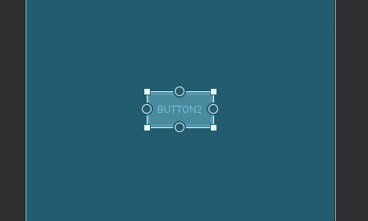
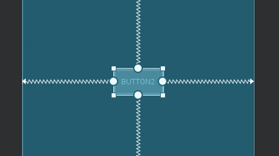
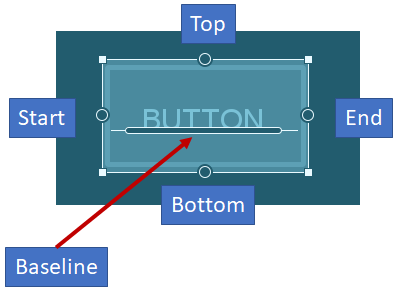
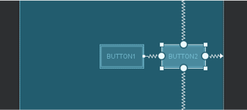
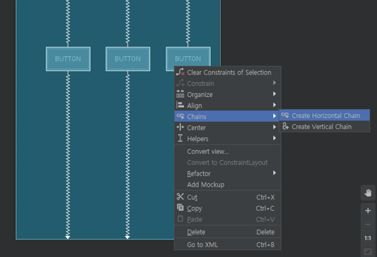
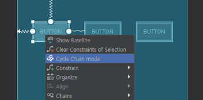
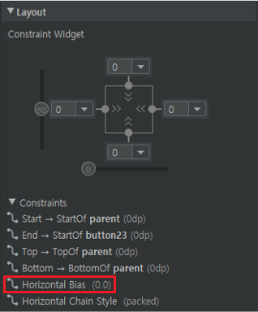

# Constraint Layout
<!-- _class: lead -->
### https://github.com/jyheo/android-kotlin-lecture


## ConstraintLayout
- 기존의 레이아웃(Linear, Relative 등)에 비해 레이아웃 중첩하지 않고도 복잡한 레이아웃을 만들 수 있음
  - Flat Hierarchy
- 안드로이드 스튜디오의 레이아웃 에디터로 만들기 편리함
  - 반대로 XML로 코딩하려면 매우 귀찮음
- 성능이 다른 레이아웃에 비해 우수함


## Constraints
- 위젯 정렬 방식 지정
- 앵커(anchor)를 사용하여 위젯들 간의 정렬 규칙을 정함
  - 위젯 선택했을 때 위,아래,왼쪽,오른쪽 테두리에 보이는 원 모양이 앵커    
    

<!-- _class: noslide -->
왼쪽은 constraint가 설정되지 않은 상태이고, 가운데는 parent와 상,하,좌,우 모두 연결된 constraint를 보여주는 것


## Constraints – Start/End, Top/Bottom
<!-- _class: double nodots noborder -->
- 
-
  ```xml
  <Button
      android:id="@+id/button1"
      android:layout_width="wrap_content"
      android:layout_height="wrap_content"
      android:text="Button"
      app:layout_constraintBottom_toBottomOf="parent"
      app:layout_constraintEnd_toEndOf="parent"
      app:layout_constraintStart_toStartOf="parent"
      app:layout_constraintTop_toTopOf="parent" />
  ```


## Constraints - Bias
<!-- _class: double nodots -->
- 
- 수평,수직 bias 값을 주어 가운데가 아니라 좌우, 상하로 이동할 수 있음
-
  ```xml
  <Button
      android:id="@+id/button1"
      android:layout_width="wrap_content"
      android:layout_height="wrap_content"
      android:text="Button"
      app:layout_constraintBottom_toBottomOf="parent"
      app:layout_constraintEnd_toEndOf="parent"
      app:layout_constraintHorizontal_bias="0.3"
      app:layout_constraintStart_toStartOf="parent"
      app:layout_constraintTop_toTopOf="parent" />
  ```

## Constraints
<!-- _class: double nodots -->
- 
- Button1의 Start, End, Top, Bottom constraint는 parent로 연결
- button2의 constraintStart를 button1의 End로 연결
-
  ```xml
  <Button
      android:id="@+id/button1"
      android:layout_width="wrap_content"
      android:layout_height="wrap_content"
      android:text="Button1"
      app:layout_constraintBottom_toBottomOf="parent"
      app:layout_constraintEnd_toEndOf="parent"
      app:layout_constraintStart_toStartOf="parent"
      app:layout_constraintTop_toTopOf="parent" />

  <Button
      android:id="@+id/button2"
      android:layout_width="wrap_content"
      android:layout_height="wrap_content"
      android:text="Button2"
      app:layout_constraintBottom_toBottomOf="parent"
      app:layout_constraintEnd_toEndOf="parent"
      app:layout_constraintStart_toEndOf="@+id/button1"
      app:layout_constraintTop_toTopOf="parent" />
  ```

## Chain
- 위젯 여러 개를 한 줄로 정렬하고 싶을 때
- 
  - 버튼 위젯 3개를 배치하고 3개를 드래그하여 모두 선택한 후 
  - 오른쪽 마우스 버튼 눌러서 팝업 메뉴 Chains > Create Horizontal Chain

---
<!-- _class: double nodots -->
- 버튼 사이의 선이 chain 모양으로 바뀌어 있고 일정한 간격으로 정렬이 됨
- 
  - 버튼간의 constraint가 서로 연결되는 형태임
-
  ```xml
  <Button
    android:id="@+id/button1"
    android:layout_width="wrap_content"
    android:layout_height="wrap_content"
    android:text="Button1"
    app:layout_constraintBottom_toBottomOf="parent"
    app:layout_constraintEnd_toStartOf="@+id/button2"
    app:layout_constraintStart_toStartOf="parent"
    app:layout_constraintTop_toTopOf="parent" />

  <Button
      android:id="@+id/button2"
      android:layout_width="wrap_content"
      android:layout_height="wrap_content"
      android:text="Button2"
      app:layout_constraintBottom_toBottomOf="parent"
      app:layout_constraintEnd_toStartOf="@+id/button3"
      app:layout_constraintStart_toEndOf="@+id/button1"
      app:layout_constraintTop_toTopOf="parent" />

  <Button
      android:id="@+id/button3"
      android:layout_width="wrap_content"
      android:layout_height="wrap_content"
      android:text="Button3"
      app:layout_constraintBottom_toBottomOf="parent"
      app:layout_constraintEnd_toEndOf="parent"
      app:layout_constraintStart_toEndOf="@+id/button2"
      app:layout_constraintTop_toTopOf="parent" />
  ```

## Chain – Mode(spread, spread_inside, packed)
<!-- _class: double -->
- Chain으로 연결 된 위젯 하나를 선택하고 오른쪽 마우스 버튼 눌러서 팝업 메뉴
- Cycle Chain mode 선택
  - Spread, Spread_inside, Packed 모드로 순환하면서 바뀜
- Spread  
- Spread Inside  
- Packed 
- 체인의 첫 번째 위젯에 속성 app:layout_constraintHorizontal_chainStyle 추가됨


## Chain - Bias
<!-- _class: double -->
- Chain으로 연결된 위젯들의 첫 위젯 Bias를 변경하면 모두 따라서 움직임
-  
-  