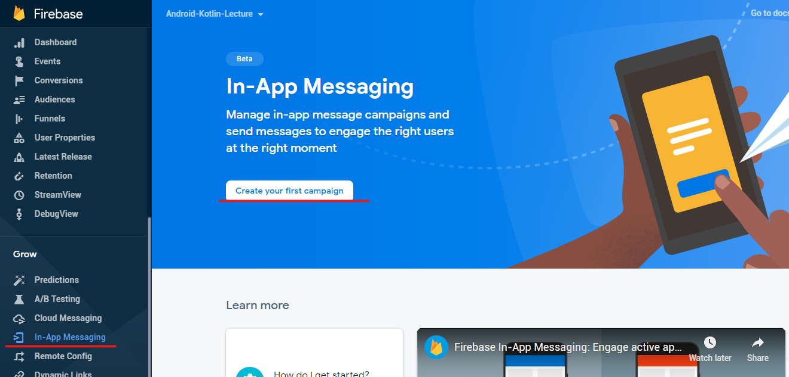
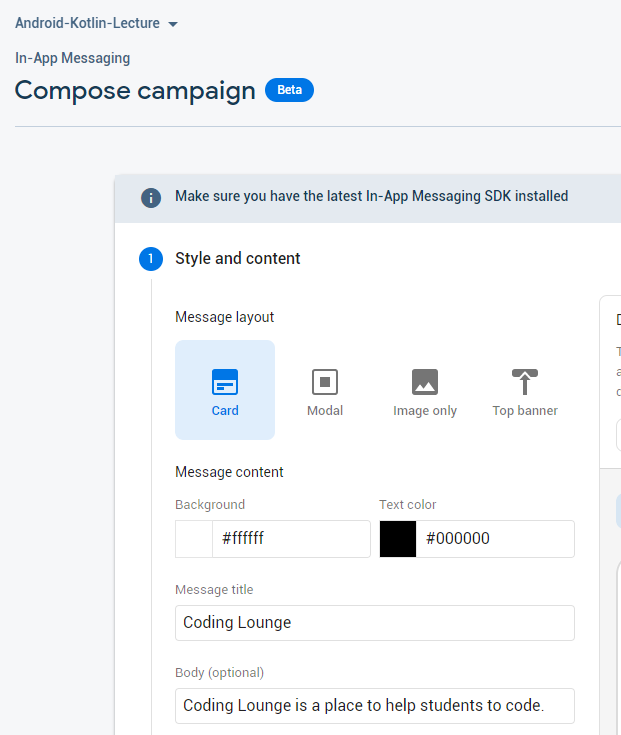
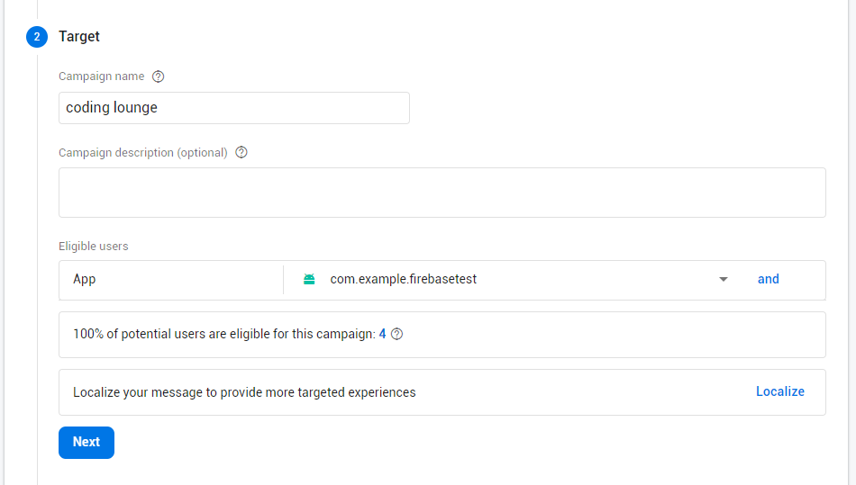
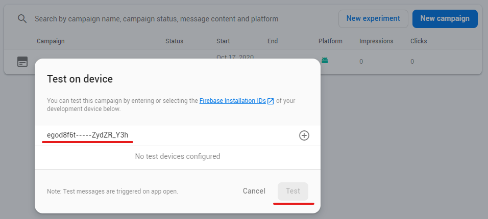
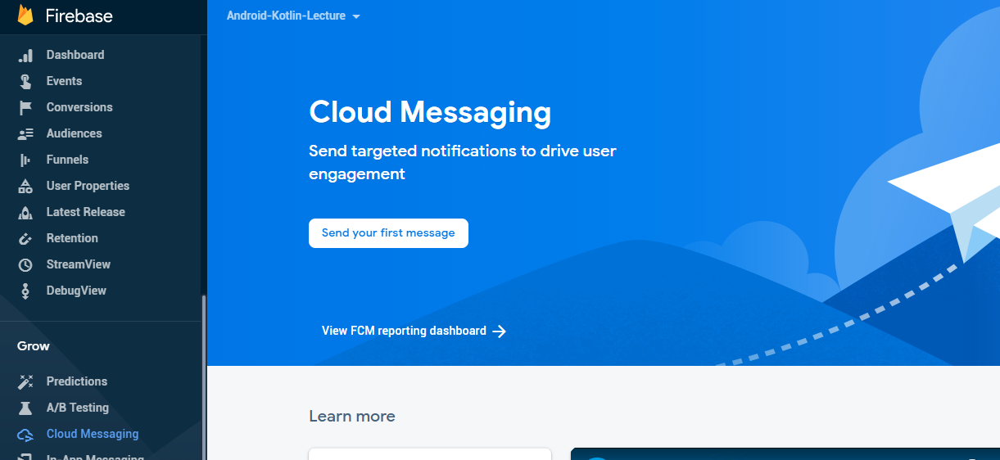
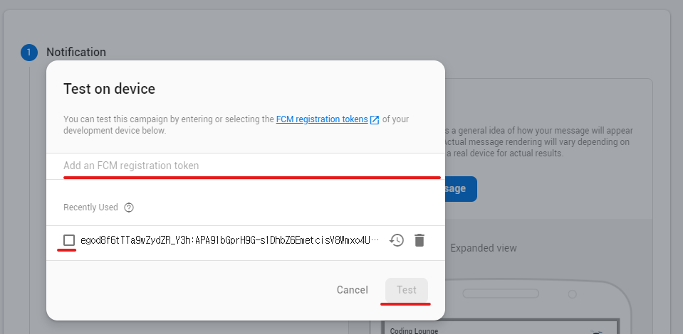
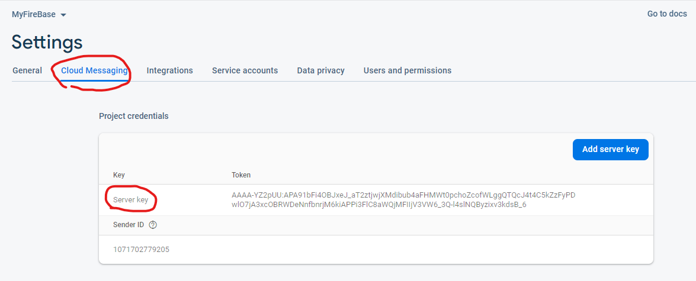

# Firebase
<!-- _class: lead -->
### In-App Messaging, Cloud Messaging
### 허준영(jyheo@hansung.ac.kr)


## Firebase 설정
- 안드로이드 앱 개발 환경과 Firebase 연결이 완료된 상태에서 시작
    - 연결 방법은 Firebase-Auth 강의 자료 참고
        - build.gradle 설정
        - google-services.json 다운로드


# In-App Messaging
<!-- _class: lead -->

## In-App Messaging
- Firebase 콘솔에서 앱에 다이얼로그나 헤드업 알림 같은 형태의 메시지를 만들어서 전달
  


## In-App Messaging - 안드로이드 앱 설정
- build.gradle
    ```gradle
    dependencies {
        // Import the BoM for the Firebase platform
        implementation platform('com.google.firebase:firebase-bom:25.12.0')

        // Declare the dependencies for the In-App Messaging and Analytics libraries
        // When using the BoM, you don't specify versions in Firebase library dependencies
        implementation 'com.google.firebase:firebase-inappmessaging-display-ktx'
        implementation 'com.google.firebase:firebase-analytics-ktx'
    }
    ```

## In-App Messaging - Firebase Console
- https://console.firebase.google.com/
- 프로젝트 생성/선택하고 In-App Messaging 선택



## In-App Messaging - Firebase Console
- In-App Message 레이아웃 만들기
  


## In-App Messaging - Firebase Console
- 대상 선택
    - 패키지 이름, 지역 등으로 제한할 수 있음



## In-App Messaging - Firebase Console
- 스케줄, 기타 옵션을 선택하고
- Publish를 누르면 완료
- 앱을 시작하면 오른쪽과 같이 캠페인 메시지가 나타남


## In-App Messaging - Firebase Console
- 하루에 한번만 보낼 수 있기 때문에, 테스트를 위해 FID를 사용함
- FID: FirebaseInstallation ID
- 앱을 실행하면 로그캣에 Info 레벨로 아래와 같은 형태로 FID출력됨
    ```
    I/FIAM.Headless: Starting InAppMessaging runtime with Installation ID 여기에출력되는값
    ```

## In-App Messaging - Firebase Console
- Firebase Console에서 In-App Messaging 선택
    - 한개 이상의 캠페인이 만들어져 있으면 아래와 같은 화면이 나옴
- 목록에서 캠페인 오른쪽 옵션 메뉴를 눌러서
    - Test on device 선택


## In-App Messaging - Firebase Console
- FID를 입력하고 추가
- Test 버튼 누르면
    - 안드로이드 디바이스에서 홈 버튼을 누르고 최근 앱에서 앱을 선택하면 캠페인 메시지가 다시 나타남



# Cloud Messaging
<!-- _class: lead -->

## Cloud Messaging
- 일반적으로 푸시 알림으로 알려진 서비스
- 클라이언트가 서버로부터 업데이트된 정보를 가져오려면
    - 주기적으로 서버에 접속해서 확인하는 방법
    - 서버가 클라이언트에 접속해서 알려주는 방법(이 방법은 일반적이지 못함, 클라이언트가 접속을 허용하지 않는 경우가 대부분)
- 누가 서버에 접속하는가?
    - 스마트폰의 여러 앱이 각자 알아서 주기적으로 서버에 접속하면?
    - 하나의 알림 서버에 시스템이 접속해서 모든 앱이 필요한 업데이트 정보를 확인해준다면? -> Firebase Cloud Messaging


## Cloud Messaging
- 특정 대상(특정 **토큰** 소유자, 앱 사용자 전체 등)에게 알림을 보낼 수 있음
- 특정 시간을 정해서 보낼 수 있음
- 사용자에게 앱의 사용을 유도하는 용도
    - 이벤트 알림 등
- 채팅 구현에 사용될 수도 있음


## Cloud Messaging - 앱 설정
- build.gradle
```gradle
dependencies {
    // Import the BoM for the Firebase platform
    implementation platform('com.google.firebase:firebase-bom:25.12.0')

    // Declare the dependencies for the Firebase Cloud Messaging and Analytics libraries
    // When using the BoM, you don't specify versions in Firebase library dependencies
    implementation 'com.google.firebase:firebase-messaging-ktx'
    implementation 'com.google.firebase:firebase-analytics-ktx'
}
```

## Cloud Messaging - 안드로이드 앱
- AndroidManifest.xml 에 서비스와 인텐트 필터 추가
    ```xml
    <service
        android:name=".MyFirebaseMessagingService"
        android:exported="false">
        <intent-filter>
            <action android:name="com.google.firebase.MESSAGING_EVENT"/>
        </intent-filter>
    </service>
    ```


## Cloud Messaging - 안드로이드 앱
- MyFirebaseMessagingService.kt
    ```kotlin
    class MyFirebaseMessagingService : FirebaseMessagingService() {
        override fun onNewToken(token: String) { // Get updated InstanceID token.
            Log.d(TAG, "Refreshed token: $token")         

            // TODO: Implement this method to send any registration to your app's servers.
            // sendRegistrationToServer(token)
        }

        override fun onMessageReceived(remoteMessage: RemoteMessage) {
            Log.d(TAG, "From: ${remoteMessage.from}")
            Log.d(TAG, "Message data payload: ${remoteMessage.data}")
            val msgBody = remoteMessage.notification?.body
            Log.d(TAG, "Message Notification Body: $msgBody")
        }

        companion object {
            const val TAG = "MyFirebaseMessaging"
        }
    }
    ```

## Cloud Messaging - 안드로이드 앱
- MyFirebaseMessagingService.kt
    - onNewToken
        - 디바이스마다 FCM(Firebase Cloud Messaging) 토큰이 할당됨, 고유한 값으로 특정 디바이스에만 메시지를 보낼 때 사용함
        - 이 토큰이 변경될 때 호출되는 메소드임
        - 앱이 재설치 되거나 할 때 변경됨
    - onMessageReceived
        - FCM 메시지를 받을 때, 앱이 현재 전면에서 실행 중이면 이 메소드가 호출됨
        - 앱이 실행 중이 아니거나 백그라운드 실행 중이면 알림(notification)이 표시됨


## Cloud Messaging - Firebase Console
- https://console.firebase.google.com/
- 프로젝트 생성/선택하고 Cloud Messaging 선택



## Cloud Messaging - Firebase Console
- 알림(Notification) 제목/내용/이미지 작성

- Target, Schedule 등 설정 입력후 Review/Publish


## Cloud Messaging
- 앱이 현재 전면에서 실행 중이라면
    - MyFirebaseMessagingService의 onReceived()가 호출되어 Logcat에 메시지 출력 확인 가능
    
- 앱이 실행 중이 아니거나 백그라운드 실행 중이라면
    - 오른쪽과 같이 시스템이 알림을 표시함
    - 알림을 선택하면 앱 실행함


## Cloud Messaging - 안드로이드 앱
- FCM에서 이 앱의 고유한 토큰 받기
    ```kotlin
    FirebaseMessaging.getInstance().token.addOnCompleteListener { // it: Task<String!>
        binding.textFCMToken.text = if (it.isSuccessful) it.result else "Token Error!"

        // copy FCM token to clipboard
        val clipboard = getSystemService(Context.CLIPBOARD_SERVICE) as ClipboardManager
        val clip = ClipData.newPlainText("FCM Token", binding.textFCMToken.text)
        clipboard.setPrimaryClip(clip)

        // write to logcat
        Log.d(MyFirebaseMessagingService.TAG, "FCM token: ${binding.textFCMToken.text}")
    }
    ```


## Cloud Messaging - Firebase Console
- 특정 FCM에 테스트 메시지 보내기


## Cloud Messaging - Firebase Console
- 특정 FCM에 테스트 메시지 보내기



## Cloud Messaging - 3rd Party 서버
- Firebase Console이 아니라 제3의 서버에서 Cloud Message를 보내기
- 앱이 실행 중이 아닌 경우 제3의 서버에서 앱으로 메시지를 보낼 수 있음
- 제3의 서버 만들기
    - 앱이 접속하여 메시지를 주고받는 서버
    - 앱은 FCM에서 받은 token을 서버에 등록
    - 서버는 앱에게 푸시 메시지를 보낼 필요가 있을 때(앱이 접속이 안되어 있는 경우 등) FCM을 통해 푸시(앱이 등록한 토큰 이용)를 보냄
- 앱과 제3의 서버간의 인증이나 보안은 별도로 해결해야 함


## Cloud Messaging - 3rd Party 서버
- Curl을 이용하여 제3서버 흉내내기 - 메시징 테스트
    - message.json 파일 작성
        ```json
        {
            "notification": {
                "title": "title here",
                "body": "message body here",
                "image": "https://이미지의URL" // 필요 없으면 빼면 됨
            },
            "to" : "FCM token값"  // FirebaseMessaging.getInstance().token 으로 받은 값
        }
        ```
    - Curl 명령 실행
        ```
        curl --header "Authorization: key=서버키값을써야함" \
            --header Content-Type:"application/json" \
            https://fcm.googleapis.com/fcm/send -d "@message.json"
        ```
    - **Authorization: key=** 는 firebase console (https://console.firebase.google.com) 에서 프로젝트 설정 > 클라우드 메시징에서 확인 가능 (Server key 토큰)


## Cloud Messaging (3rd Party 서버)
- Firebase Console 첫 화면에서 Project Overview 옆의 설정 아이콘 > Project settings
- **Authorization: key=**
    


## Cloud Messaging (3rd Party 서버)
- 현재 HTTPv1 프로토콜을 새로 지원하고 있음
    - https://firebase.google.com/docs/cloud-messaging/migrate-v1?hl=ko


## 예제 소스 코드 전체
-  https://github.com/jyheo/android-kotlin-lecture/blob/master/examples/firebasetest/app/src/main/java/com/example/firebasetest/


## 실습
- Cloud Messaging Test
- 앱을 시작하면 FCM Token을 액티비티 화면에 표시
- Cloud Messaging 에서 알림을 보내면
    - 앱이 전면에서 실행중에는 액티비티에 메시지 수신 내용을 표시하고
        - 참고 코드
        ```kotlin
        startActivity(
            Intent(this, MainActivity::class.java).apply {
                setFlags(Intent.FLAG_ACTIVITY_NEW_TASK or Intent.FLAG_ACTIVITY_CLEAR_TOP)
                putExtra("message", msgBody)
            })
        ```
    - 앱이 전면에 실행중이 아닐 때에는 알림을 표시하고 알림을 선택하면 액티비티가 시작되도록 한다.
